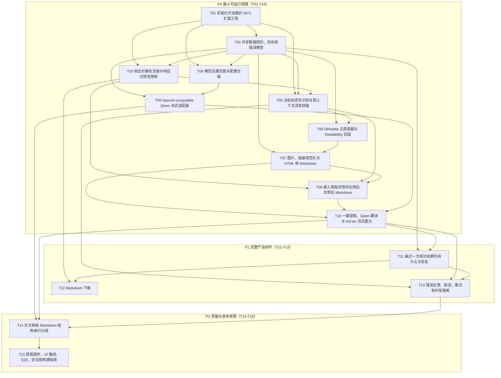

# Chrome 英文网页翻译插件任务拆分

## 1. 计划目标

本计划依据以下文档拆分：

- [产品需求文档](./proposal.md)
- [技术架构设计文档](./desgin.md)
- [侧边栏主页面布局](./layout/侧边栏主页面.md)
- [设置页面布局](./layout/设置页面.md)

目标是让 AI 按任务逐步实现 Chrome 英文网页翻译插件。每个任务均应形成可独立检查的成果，优先交付可见页面，再逐步接入配置、正文提取、流式翻译、持久化与下载能力。

## 2. 执行规则

1. 严格按优先级和依赖关系执行，一次只实现一个任务。
2. 开始任务前只读取该任务列出的参考文档、依赖接口和相关文件。
3. 不提前实现后续任务，不加入历史、收藏、编辑器、主题切换或多语言等范围外能力。
4. 每个任务必须通过类型检查、对应测试和“完成效果”检查后才可结束。
5. 新增外部输入按 `unknown` 处理，并在边界完成校验；禁止无理由使用 `any`。
6. 页面组件不得直接访问 Chrome Storage、页面 DOM 或模型供应商协议。
7. 任务完成后记录实际变更文件、验证命令和验证结果，但不得自动提交 Git。
8. 若前置任务接口确需修改，应先更新共享契约及其测试，再调整当前任务。
9. API Key、真实文章、完整模型响应和授权头不得进入源码、测试快照或日志。

## 3. 优先级定义

| 优先级 | 含义 | 处理规则 |
|---|---|---|
| P0 | 最小可运行链路 | 必须按顺序完成，最终能够真实翻译当前网页 |
| P1 | 完整产品闭环 | 在 P0 后完成，满足持久化、下载、恢复和异常要求 |
| P2 | 质量与发布保障 | 在功能闭环后完成，保证复杂网页、性能、安全与扩展发布质量 |

## 4. 总体依赖与可见增量

```text
T01 扩展工程可运行
 |
 +--> T02 共享契约与错误模型
 |     |
 |     +--> T04 设置页面与配置存储
 |     +--> T05 当前标签页与消息链路
 |     +--> T08 侧边栏状态机
 |
 +--> T03 侧边栏静态页面
       |
       +--> T04 设置页面与配置存储
       +--> T08 侧边栏状态机

T05 --> T06 正文提取 --> T07 Markdown 转换
                               |
T04 --> T09 OpenAI/Qwen 流适配 --+--> T10 一键翻译端到端
T08 ----------------------------+

T10 --> T11 最近结果持久化 --> T12 Markdown 下载
T10 --> T13 错误、取消与并发控制
T12 + T13 --> T14 长文章分段
T14 --> T15 集成、E2E、安全与发布检查
```

以下为完整的任务依赖关系图（Mermaid，含各任务声明的所有前置依赖，并按优先级分组）：



每个里程碑完成后的用户可见效果：

| 里程碑 | 包含任务 | 可见效果 |
|---|---|---|
| M1 扩展壳 | T01-T03 | Chrome 可加载扩展并打开符合示意图的侧边栏 |
| M2 配置与页面通信 | T04-T05 | 可保存 Qwen 配置，并能识别当前标签页 |
| M3 提取预览 | T06-T08 | 点击按钮可提取文章并用 `md-wx` 显示 Markdown |
| M4 真实翻译 | T09-T10 | 当前英文文章可流式翻译成中文 |
| M5 产品闭环 | T11-T13 | 可恢复最近结果、下载 Markdown、取消和重试 |
| M6 质量完成 | T14-T15 | 长文章、复杂页面、权限、安全和构建均通过验证 |

---

## 5. P0：最小可运行链路

### T01：初始化可加载的 Manifest V3 扩展工程

**目标**

建立 React、TypeScript、Vite、Manifest V3、Side Panel 和测试基础，使项目可以构建并由 Chrome 加载。

**依赖**：无。

**主要文件**

- 修改：`package.json`
- 修改：`package-lock.json`
- 创建：`tsconfig.json`
- 创建：`vite.config.ts`
- 创建：`manifest.config.ts`
- 创建：`eslint.config.js`
- 创建：`sidepanel.html`
- 创建：`options.html`
- 创建：`src/background/index.ts`
- 创建：`src/sidepanel/main.tsx`
- 创建：`src/options/main.tsx`
- 创建：`src/test/setup.ts`

**实现内容**

- 安装 React、TypeScript、Vite、Chrome 扩展构建插件、ESLint、Prettier、Vitest 和 Testing Library。
- 保留已安装的 `md-wx`，不要重复引入其他 Markdown 渲染器。
- 配置 Side Panel、Options Page、Background Service Worker 和后续 Content Script 入口。
- Manifest 首期仅声明 `activeTab`、`scripting`、`sidePanel`、`storage` 及受信 Qwen 服务域名。
- 通过工具栏图标打开侧边栏；Service Worker 不持有长任务状态。
- 建立 `dev`、`build`、`typecheck`、`lint`、`test` 脚本。

**独立验收**

- 依赖安装成功且锁文件更新。
- 构建命令生成可加载的 `dist`。
- Chrome 加载 `dist` 后，点击扩展图标能打开空白侧边栏。
- Options Page 可直接打开且无控制台错误。
- 类型检查、Lint 和空测试集可运行。

**完成效果**：得到一个能在 Chrome 中加载、打开侧边栏和设置页的扩展壳。

---

### T02：建立共享数据契约、状态和错误模型

**目标**

先固定各运行上下文之间的接口，使后续模块能够并行开发而不直接依赖第三方返回类型。

**依赖**：T01。

**主要文件**

- 创建：`src/shared/contracts/article.ts`
- 创建：`src/shared/contracts/settings.ts`
- 创建：`src/shared/contracts/translation.ts`
- 创建：`src/shared/messaging/messages.ts`
- 创建：`src/shared/errors/app-error.ts`
- 创建：`src/shared/contracts/contracts.test.ts`

**产出接口**

- `ExtractedArticle`：版本、URL、标题、作者、语言、站点、Markdown 正文、字符数、提取器、质量分数、提取时间。
- `ModelSettings`：版本、Base URL、API Key、模型名称。
- `TranslationResult`：版本、原文 URL、标题、作者、完整 Markdown、完成时间、模型标识。
- `TranslationState`：`idle | extracting | translating | completed | failed | cancelled` 可辨识联合。
- 版本化提取请求、成功响应和失败响应消息。
- 统一领域错误码，覆盖受限页面、提取失败、配置错误、网络、鉴权、限流、流中断、输出非法和存储失败。

**独立验收**

- 契约不导入 Defuddle、Readability、OpenAI SDK、React 或 Chrome API 类型。
- 消息和状态可通过 TypeScript 穷尽检查。
- 外部载荷校验测试覆盖合法、缺字段、错误版本和错误字段类型。

**完成效果**：后续模块拥有稳定、可测试的通信边界。

---

### T03：实现侧边栏静态页面与响应式视觉骨架

**目标**

先交付可见主页面，使用模拟数据呈现所有状态，不接入真实提取或模型请求。

**依赖**：T01；仅使用 T02 的状态类型。

**示意图与模块**

- 页面参考：[侧边栏主页面布局](./layout/侧边栏主页面.md)
- 顶部栏：产品名、设置入口。
- 当前网页摘要：标题、域名。
- 主操作区：一键翻译、取消、重试、重新翻译。
- 状态反馈区：提取中、翻译中、完成、失败、取消。
- 译文阅读区：`md-wx` 的 `MarkdownRenderer`。
- 底部操作区：下载 Markdown，当前任务只展示禁用或模拟按钮。

**主要文件**

- 创建：`src/sidepanel/App.tsx`
- 创建：`src/sidepanel/components/HeaderBar.tsx`
- 创建：`src/sidepanel/components/PageSummary.tsx`
- 创建：`src/sidepanel/components/StatusPanel.tsx`
- 创建：`src/sidepanel/components/TranslationView.tsx`
- 创建：`src/sidepanel/components/ActionBar.tsx`
- 创建：`src/sidepanel/styles/index.css`
- 创建：`src/sidepanel/App.test.tsx`
- 修改：`src/sidepanel/main.tsx`

**实现内容**

- 按布局文档实现空闲、提取/翻译、完成、失败/取消状态。
- 使用窄侧边栏优先布局，不增加多栏、抽屉或浮动工具栏。
- 引入 `md-wx/dist/style.css`，关闭设置面板、视图切换和非核心能力。
- 测试通过注入状态和模拟 Markdown 切换视图，不接入真实 Chrome API。
- 提供可访问的按钮名称、焦点样式和状态文本。

**独立验收**

- 可在开发预览或 Chrome Side Panel 中逐一查看六种状态。
- Markdown 标题、引用、正文、链接和图片语法可渲染。
- 侧边栏窄宽度下不出现横向页面滚动。
- 页面只突出“一键翻译”和完成后的“下载 Markdown”。

**完成效果**：用户能看到与 ASCII 示意图一致的完整侧边栏外观。

---

### T04：实现模型设置页面与配置仓储

**目标**

让用户在独立设置页中配置 Qwen OpenAI-compatible 服务，并将配置保存在本地。

**依赖**：T01、T02。

**示意图与模块**

- 页面参考：[设置页面布局](./layout/设置页面.md)
- 顶部栏、Base URL、API Key、模型名称、安全提示、保存反馈和保存按钮。

**主要文件**

- 创建：`src/storage/settings-repository.ts`
- 创建：`src/storage/settings-repository.test.ts`
- 创建：`src/options/App.tsx`
- 创建：`src/options/components/ModelSettingsForm.tsx`
- 创建：`src/options/styles/index.css`
- 创建：`src/options/App.test.tsx`
- 修改：`src/options/main.tsx`
- 修改：`src/sidepanel/components/HeaderBar.tsx`

**实现内容**

- Repository 提供读取、覆盖保存和配置完整性判断，不保存文章内容。
- Base URL 必须为允许的 HTTPS Qwen OpenAI-compatible 地址。
- API Key 和模型名称必填；API Key 默认隐藏，可在当前表单中显隐。
- 保存成功和失败均提供明确反馈，不回显完整密钥。
- 侧边栏设置按钮打开 Options Page；返回侧边栏时可重新读取配置。

**独立验收**

- 刷新设置页后能恢复已保存配置。
- 空字段、HTTP 地址和不受信地址无法保存。
- 保存动作不会调用模型服务。
- API Key 不进入 URL、控制台、页面提示或测试快照。

**完成效果**：设置页面可独立完成 Qwen 连接配置并持久化。

---

### T05：实现当前标签页识别与跨上下文消息链路

**目标**

打通 Side Panel、Background 和 Content Script，不做正文算法，先证明当前页面可以被安全访问。

**依赖**：T01、T02、T03。

**主要文件**

- 创建：`src/background/tab-policy.ts`
- 创建：`src/background/tab-policy.test.ts`
- 创建：`src/content/index.ts`
- 创建：`src/shared/messaging/client.ts`
- 创建：`src/shared/messaging/client.test.ts`
- 修改：`src/background/index.ts`
- 修改：`src/sidepanel/App.tsx`
- 修改：`manifest.config.ts`

**实现内容**

- 获取当前活动标签页的标题、URL 和域名。
- 拒绝 Chrome 内部页、扩展页、空 URL 及禁止注入页面。
- 每次请求携带唯一请求 ID 和协议版本。
- Content Script 先返回页面标题、URL 和简单可见文本统计作为探针结果。
- 侧边栏空闲态显示真实当前网页摘要；受限页面禁用翻译按钮。

**独立验收**

- 普通 HTTPS 文章页面显示正确标题和域名。
- `chrome://` 页面显示“不支持当前页面”，且不会尝试注入。
- 页面刷新、切换标签页和快速重复请求不会串用响应。

**完成效果**：侧边栏能识别当前网页，并清晰区分可处理与受限页面。

---

### T06：实现 Defuddle 主提取器与 Readability 回退

**目标**

从当前页面克隆 DOM 中提取标题、作者和主要正文 HTML，并通过质量评分选择候选结果。

**依赖**：T02、T05。

**主要文件**

- 创建：`src/content/extractors/extractor.ts`
- 创建：`src/content/extractors/defuddle-extractor.ts`
- 创建：`src/content/extractors/readability-extractor.ts`
- 创建：`src/content/extractors/quality-evaluator.ts`
- 创建：`src/content/extractors/extract-article.ts`
- 创建：`src/content/extractors/extract-article.test.ts`
- 创建：`src/test/fixtures/article-standard.html`
- 创建：`src/test/fixtures/article-noisy.html`
- 创建：`src/test/fixtures/article-fallback.html`
- 修改：`src/content/index.ts`
- 修改：`package.json`
- 修改：`package-lock.json`

**实现内容**

- 安装并锁定 Defuddle 与 `@mozilla/readability`。
- 克隆当前 DOM，移除脚本、样式、表单、对话框和确定性非正文节点。
- 默认运行 Defuddle；结果异常或质量不足时运行 Readability。
- 质量评分至少使用正文长度、标题、段落、链接密度、重复段落和噪声信号。
- 将第三方返回值转换为内部候选对象，原始类型不得离开提取器目录。
- 不绕过登录、付费墙、验证码，不自动滚动页面。

**独立验收**

- 标准文章优先选择 Defuddle。
- 构造的低质量主结果会触发 Readability 并选择更高分结果。
- 新闻噪声固件不包含导航、广告、评论和订阅弹窗文本。
- 提取过程不修改测试页面原 DOM。

**完成效果**：点击翻译前可以稳定识别当前页面的主要文章及元数据。

---

### T07：实现图片、链接规范化与 HTML 转 Markdown

**目标**

把提取出的正文 HTML 转换为可脱离原页面使用的标准 Markdown。

**依赖**：T02、T06。

**主要文件**

- 创建：`src/content/normalization/images.ts`
- 创建：`src/content/normalization/links.ts`
- 创建：`src/content/normalization/metadata.ts`
- 创建：`src/content/markdown/converter.ts`
- 创建：`src/content/markdown/converter.test.ts`
- 创建：`src/test/fixtures/article-images.html`
- 修改：`src/content/extractors/extract-article.ts`
- 修改：`package.json`
- 修改：`package-lock.json`

**实现内容**

- 安装并锁定 Turndown 和 GFM 插件。
- 将正文相对链接和图片地址转换为基于原文 URL 的绝对地址。
- 规范化 `src`、`srcset` 和常见延迟加载属性，排除占位图和跟踪像素。
- 图片严格输出为 `` 并保持正文位置。
- 保留标题、段落、列表、引用、表格、代码块和链接语义。
- 输出完整 `ExtractedArticle`，不传输 DOM 或完整原始 HTML。

**独立验收**

- 图片、相对 URL、`srcset` 和延迟加载固件转换结果稳定。
- 代码块内容、链接目标和图片 URL 不被修改。
- 输出不包含脚本、样式、表单控件和事件属性。
- 相同输入重复转换得到相同 Markdown。

**完成效果**：当前网页可转换为结构清晰、图片可用的 Markdown 文章对象。

---

### T08：接入提取流程并在侧边栏预览 Markdown

**目标**

在不调用 AI 的情况下完成“一键翻译”按钮到文章提取和 `md-wx` 预览的首个端到端可见切片。

**依赖**：T03、T05、T07。

**示意图与模块**

- 参考：[侧边栏主页面布局的提取与翻译状态](./layout/侧边栏主页面.md#32-提取与翻译状态)
- 使用状态反馈区、译文阅读区和失败状态模块。

**主要文件**

- 创建：`src/sidepanel/hooks/use-translation-session.ts`
- 创建：`src/sidepanel/hooks/use-translation-session.test.ts`
- 修改：`src/sidepanel/App.tsx`
- 修改：`src/sidepanel/components/TranslationView.tsx`
- 修改：`src/shared/messaging/messages.ts`

**实现内容**

- 点击主按钮后进入 `extracting`，禁用重复触发。
- 成功后暂时把原文 Markdown 放入译文阅读区，并标记为“提取预览”。
- 提取失败进入 `failed`，不出现伪造译文。
- 新请求使用新请求 ID，旧响应到达时被丢弃。
- 预览模式仅用于本任务验证，T10 接入真实翻译时移除该标识。

**独立验收**

- 在典型文章页点击一次即可看到提取后的 Markdown。
- 图片、标题、列表和代码块由 `md-wx` 正确渲染。
- 无正文页面显示明确失败信息。
- 快速重复点击不会产生重复内容。

**完成效果**：用户已经能看到“一键读取当前文章并在侧边栏显示”的完整效果。

---

### T09：实现 OpenAI-compatible Qwen 流式适配器

**目标**

独立封装 OpenAI JavaScript SDK 流式调用，以模拟流测试请求、增量、取消、超时和错误归一化。

**依赖**：T02、T04。

**主要文件**

- 创建：`src/translation/providers/translation-provider.ts`
- 创建：`src/translation/providers/openai-compatible.ts`
- 创建：`src/translation/providers/openai-compatible.test.ts`
- 创建：`src/translation/prompt-policy.ts`
- 创建：`src/translation/prompt-policy.test.ts`
- 修改：`package.json`
- 修改：`package-lock.json`

**产出接口**

- Provider 接收模型设置、文章输入和 `AbortSignal`。
- Provider 以异步文本增量形式输出最终内容，不暴露 OpenAI SDK 流事件。
- Prompt 固定要求只输出 Markdown，翻译标题和正文，保留作者、URL、代码、图片和链接目标。

**实现内容**

- 安装并锁定 OpenAI JavaScript SDK。
- 使用 Chat Completions 流式接口连接 Qwen OpenAI-compatible 服务。
- 仅消费最终文本增量，忽略空事件和供应商扩展事件。
- 默认不启用搜索、工具调用和代码执行。
- 归一化网络、超时、鉴权、限流、模型不可用和流中断错误。
- 单元测试只使用模拟流，不调用真实付费服务。

**独立验收**

- 模拟流可按顺序产出中文多字节增量。
- 取消信号能停止消费后续事件。
- 第三方错误不会原样泄漏 API Key、授权头或完整响应。
- 替换 Base URL、API Key 和模型名无需修改调用方。

**完成效果**：模型层可以被 UI 独立调用和测试，但尚未接入当前网页流程。

---

### T10：打通一键提取、Qwen 翻译与 md-wx 流式展示

**目标**

完成首个真实可用 P0 闭环：用户点击一次，从当前英文网页提取正文并看到逐步产生的中文 Markdown。

**依赖**：T07、T08、T09。

**示意图与模块**

- 参考：[侧边栏主页面布局](./layout/侧边栏主页面.md)
- 重点实现提取状态、翻译状态、流式译文阅读区、取消按钮和完成状态。

**主要文件**

- 创建：`src/translation/orchestrator.ts`
- 创建：`src/translation/orchestrator.test.ts`
- 创建：`src/translation/output-validator.ts`
- 创建：`src/translation/output-validator.test.ts`
- 修改：`src/sidepanel/hooks/use-translation-session.ts`
- 修改：`src/sidepanel/components/TranslationView.tsx`
- 修改：`src/sidepanel/App.tsx`

**实现内容**

- 配置缺失时跳转设置页，不提取或发送正文。
- 提取成功后由 Orchestrator 组装模型输入并启动流式请求。
- 增量追加到单一 Markdown 缓冲区，UI 按固定短间隔批量刷新。
- 首个增量到达后从 `extracting` 切换为 `translating`。
- 流结束后刷新剩余缓冲，校验标题、作者、原文链接和正文顺序。
- 移除 T08 的“提取预览”，正常界面只显示译文。

**独立验收**

- 使用模拟 Provider 的集成测试验证无重复、无乱序和完整结束。
- 使用短英文公开文章和专用测试密钥执行一次受控真实 Qwen 验证。
- Markdown 图片地址、链接目标和代码内容在翻译前后保持不变。
- UI 可清楚区分提取、翻译、完成和失败状态。

**完成效果**：插件可真实完成当前英文网页的一键流式中文翻译。

---

## 6. P1：完整产品闭环

### T11：实现最近一次成功结果的持久化与恢复

**目标**

只保存最近一次完整成功结果，并在侧边栏重开后恢复显示。

**依赖**：T02、T10。

**主要文件**

- 创建：`src/storage/result-repository.ts`
- 创建：`src/storage/result-repository.test.ts`
- 创建：`src/storage/migrations.ts`
- 创建：`src/storage/migrations.test.ts`
- 修改：`src/translation/orchestrator.ts`
- 修改：`src/sidepanel/hooks/use-translation-session.ts`

**实现内容**

- Repository 读取和单次覆盖写入版本化 `TranslationResult`。
- 只有流正常结束且输出校验通过后才保存。
- 失败、取消、部分流和非法输出不得写入。
- 侧边栏初始化时读取最近结果；读取失败显示提示但不阻止新翻译。
- 新成功结果覆盖旧结果，不建立数组、索引或历史页面。

**独立验收**

- 关闭并重开侧边栏后可查看最近一次成功结果。
- 第二次成功翻译后本地仅保留第二次结果。
- 模拟流中断、取消和校验失败均不会覆盖旧结果。
- 存储对象不含 API Key、原始 HTML、DOM 或中间增量。

**完成效果**：用户重开插件仍可阅读最近译文，失败不会破坏旧结果。

---

### T12：实现 Markdown 下载

**目标**

允许用户把当前完整成功译文下载为 UTF-8 `.md` 文件。

**依赖**：T03、T11。

**示意图与模块**

- 参考：[侧边栏主页面完成状态](./layout/侧边栏主页面.md#33-完成状态)
- 使用完成状态底部的“下载 Markdown”主按钮。

**主要文件**

- 创建：`src/sidepanel/download/create-markdown-download.ts`
- 创建：`src/sidepanel/download/create-markdown-download.test.ts`
- 修改：`src/sidepanel/components/ActionBar.tsx`
- 修改：`src/sidepanel/App.tsx`

**实现内容**

- 以完整译文创建 UTF-8 Markdown Blob，并通过用户点击触发下载。
- 文件名优先使用净化后的译文标题，移除 Windows 和通用文件系统非法字符并限制长度。
- 标题为空时使用 `translated-article.md`。
- 仅完成状态启用下载；失败、取消和翻译中不允许下载部分结果。
- 不创建服务端文件、不下载正文图片、不增加历史记录。

**独立验收**

- 下载文件可用文本编辑器打开，中文无乱码。
- 标题、作者、原文链接、正文顺序符合需求模板。
- 图片保持 ``，链接和代码块保持完整。
- 非法标题不会生成非法文件名。

**完成效果**：翻译完成后可一键下载可移植的 Markdown 文件。

---

### T13：完善错误反馈、取消、重试和并发隔离

**目标**

让所有失败路径有明确结果，并保证旧请求永远不能覆盖新请求或成功存储。

**依赖**：T05、T10、T11。

**示意图与模块**

- 参考：[侧边栏主页面失败或取消状态](./layout/侧边栏主页面.md#34-失败或取消状态)
- 使用状态反馈区、重试、打开设置和“旧结果未覆盖”提示。

**主要文件**

- 创建：`src/shared/errors/user-message.ts`
- 创建：`src/shared/errors/user-message.test.ts`
- 修改：`src/translation/orchestrator.ts`
- 修改：`src/sidepanel/hooks/use-translation-session.ts`
- 修改：`src/sidepanel/components/StatusPanel.tsx`
- 修改：`src/sidepanel/components/ActionBar.tsx`

**实现内容**

- 新请求开始前取消旧请求，并递增或替换请求 ID。
- 用户取消后进入 `cancelled`，停止渲染后续增量。
- 临时网络错误和限流显示“重试”；鉴权与配置错误显示“打开设置”。
- 页面受限、无正文和输出非法不自动重试。
- 重试重新提取当前活动页面，不复用可能过期的 DOM 结果。
- 错误文案不得包含堆栈、第三方原始响应、正文或密钥。

**独立验收**

- 快速连续启动两次时只显示第二次结果。
- 取消后模拟 Provider 继续发事件也不会更新 UI 或存储。
- 各错误码映射到稳定、可理解的中文文案和正确操作。
- 失败、取消和重试失败均保留最近成功结果。

**完成效果**：网络波动、配置错误和用户取消时界面行为可预期且数据安全。

---

## 7. P2：质量与发布保障

### T14：实现长文章按 Markdown 结构串行分段

**目标**

在输入超过安全阈值时保持 Markdown 块完整、翻译顺序稳定，并执行整篇成功语义。

**依赖**：T09、T10、T13。

**主要文件**

- 创建：`src/translation/chunking.ts`
- 创建：`src/translation/chunking.test.ts`
- 修改：`src/translation/orchestrator.ts`
- 修改：`src/translation/prompt-policy.ts`
- 修改：`src/translation/output-validator.ts`

**实现内容**

- 按二级标题、段落、完整列表和完整代码块边界切分，不按任意字符截断。
- 标题和元数据只生成一次。
- 分段串行请求并按原序合并，禁止并行导致乱序。
- 图片与相邻说明段落尽量处于同一分段。
- 任一分段失败则整篇未完成，不持久化、不开放下载。
- 安全阈值和最大分段数集中配置并有边界测试，不散落魔法数字。

**独立验收**

- 超长固件被稳定分段，代码围栏、列表和图片语法不被切断。
- 模拟多段流严格按原序合并，标题和元数据只出现一次。
- 中间分段失败不会保存部分结果。

**完成效果**：长文章也能按顺序翻译，且不会因切分破坏 Markdown。

---

### T15：完成提取固件、UI 集成、E2E、安全和构建验收

**目标**

覆盖需求文档中的最终验收标准，形成可交付 Chrome 扩展构建产物。

**依赖**：T01-T14 全部完成。

**主要文件**

- 扩充：`src/test/fixtures/`
- 创建：`tests/integration/translation-flow.test.ts`
- 创建：`tests/e2e/extension-flow.test.ts`
- 修改：`manifest.config.ts`
- 修改：`package.json`
- 修改：`package-lock.json`

**实现内容**

- 固件覆盖新闻、技术博客、教程、表格、代码、图片、延迟加载、广告、导航、评论、订阅弹窗、无正文和回退提取。
- 集成测试覆盖提取、Markdown、模拟流、校验、存储和下载内容。
- E2E 覆盖加载扩展、打开侧边栏、设置配置、启动翻译、流式显示、取消、恢复最近结果和下载。
- 检查 Manifest 权限最小化、Content Security Policy、受信模型域名和无远程可执行代码。
- 检查 Markdown 渲染不会执行脚本、事件属性或危险 URL。
- 检查日志、测试快照和构建产物不包含 API Key 或真实文章。
- 执行 Lint、类型检查、单元测试、集成测试和生产构建。

**独立验收**

- 需求文档第 7 节各项验收标准均能映射到自动测试或明确人工验收步骤。
- Chrome 加载生产构建后可完成真实端到端流程。
- 侧边栏与设置页符合各自 ASCII 布局，没有范围外功能。
- 构建产物不含密钥、测试固件、源码映射中的敏感内容或远程脚本。

**完成效果**：得到满足需求、架构、安全和页面布局约束的可交付扩展版本。

---

## 8. AI 单任务执行模板

AI 每次执行一个任务时，应使用以下输入和输出结构。

### 8.1 开始任务前

```text
当前任务：Txx - 任务名称
允许范围：仅任务列出的文件与为通过测试必需的直接配置
前置依赖：确认依赖任务验收通过
参考页面：列出该任务对应的 docs/layout 文件和具体状态
禁止范围：不实现后续任务，不增加产品范围外功能
```

### 8.2 任务执行顺序

1. 读取任务涉及的已有文件和共享契约。
2. 为本任务的核心行为编写失败测试。
3. 运行定向测试，确认测试因缺少当前行为而失败。
4. 实现满足测试的最小功能。
5. 运行定向测试、类型检查和 Lint。
6. 按“独立验收”检查可见效果。
7. 汇总变更文件、验证结果和仍受后续任务限制的能力。

### 8.3 完成报告

```text
任务：Txx
状态：完成 / 阻塞
变更文件：逐项列出
自动验证：命令及结果
可见效果：用户当前能看到或操作什么
未包含：明确指出未提前实现的后续能力
阻塞项：仅在确有阻塞时填写具体证据
```

## 9. 需求覆盖矩阵

| 需求 | 对应任务 |
|---|---|
| Chrome 侧边栏与插件入口 | T01、T03、T05 |
| 当前网页主要文章提取 | T05、T06 |
| Markdown 转换与正文顺序 | T07 |
| 图片 `` 与原位置 | T07、T15 |
| OpenAI SDK 兼容 Qwen | T04、T09 |
| 流式打字机展示 | T03、T10 |
| 最终固定输出结构 | T09、T10 |
| 最近一次成功结果 | T11 |
| Markdown 下载 | T12 |
| 取消、失败、重试与旧请求隔离 | T13 |
| 长文章 | T14 |
| 隐私、最小权限和安全渲染 | T01、T04、T05、T09、T15 |
| 最终验收与生产构建 | T15 |

## 10. 完成定义

整个计划只有在以下条件全部满足时才算完成：

- 用户能在受支持的英文文章页一键启动翻译。
- 侧边栏依次显示提取、翻译、完成或失败状态。
- Qwen 中文译文以流式方式持续呈现，无明显重复和乱序。
- 最终 Markdown 包含标题、作者、原文链接和完整正文。
- 正文图片保持 `` 和原文位置，链接与代码不被破坏。
- 最近一次成功结果可恢复，失败和取消不覆盖它。
- 完成结果可下载为 UTF-8 `.md` 文件。
- 不存在历史、账户、同步、收藏、编辑器或其他范围外功能。
- 类型检查、Lint、测试、生产构建和 Chrome E2E 验证全部通过。
